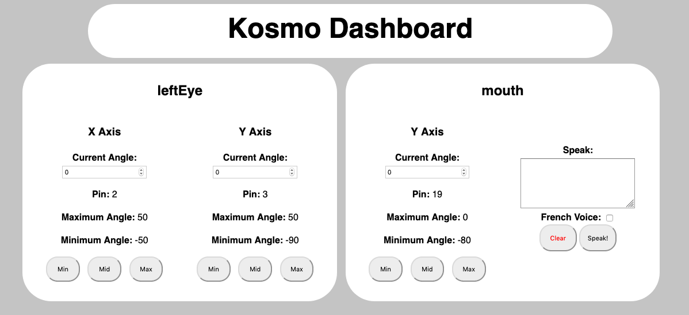

# Kosmo
An animatronic face controlled via servos and a Raspberry Pi

## Installation
For development, clone the repository and install dependencies via pipenv

`pipenv install`

This project runs on python3.5, because the Raspberry Pi doesn't play well with newer versions.

## API
A Flask server, that controls the robot, and runs the dashboard

#### `/` (GET)
Returns the dashboard. Meant to be accessed via a web browser. 



Each "bubble" has a part, and all the servos related to the part are available for configuration. Each servo allows for its angle to be changed, by entering a direct value, or hitting the Min, Mid, or Max buttons

When controlling a servo, a `/control` request is sent, and all the angles are updated with the correct value

#### `/add` (POST)
An endpoint to add parts to the face instance

Arguments can be passed via multipart form or JSON

##### Arguments
   * `part` (String): The type of part to add. Must be `eye`, `mouth`, or `eyebrow`
   *  Any of the parameters required for a specific part. See the appropriate part in the Face Sub-Library section below.
   
See Example Below

```json
[
  {
    "part": "eye",
    "side": "left",
    "xPin": 2,
    "yPin": 3
  },
  {
    "part": "eye",
    "side": "right",
    "xPin": 20,
    "yPin": 21,
    "yMax": 90
  },
  {
    "part": "mouth",
    "pin": 19,
    "yMax": 0,
    "yMin": -80
  }
]
```

#### `/control` (POST)
An endpoint to control specific servos/parts

Arguments can be passed via multipart form or JSON

##### Arguments
   * `part` (string): The part the servo belongs to. Must be `leftEye`, `rightEye`, `mouth`, `leftEyebrow`, or `rightEyebrow`
   * `axis` (string): The axis the servo controls. Must be `x` or `y`
   * `cmd` (string): The command to be run. Must be `min`, `mid`, `max`, or `set`. `min`, `mid`, and `max` set the servo to their minimum, middle, or maximum position. `set` sets the servo's angle to the value of the `angle` param.
   * `angle` (string) (optional): The angle to set the servo to. Only required if `cmd` is `set`.

##### Response
This endpoint responds with the current angle position for all servos, which can be used to update the dashboard. An example is shown below.

```json
{
  "leftEye": {
    "x": 50,
    "y": -90
  },
  "mouth": {
    "y": -80
  },
  "rightEye": {
    "x": -50,
    "y": 90
  }
}
```

#### `/save` (GET)
Saves the current setup to a config file and is auto-loaded on start.

Specifically, it saves to `config.json` at the root of the repo dir. It also returns the current setup as a response to the request. See example below.

```json
[
  {
    "part": "mouth",
    "pin": 19,
    "yMax": 0,
    "yMin": -80
  },
  {
    "part": "eye",
    "side": "left",
    "xMax": 50,
    "xMin": -50,
    "xPin": 2,
    "yMax": 50,
    "yMin": -90,
    "yPin": 3
  },
  {
    "part": "eye",
    "side": "right",
    "xMax": 50,
    "xMin": -50,
    "xPin": 20,
    "yMax": 90,
    "yMin": -90,
    "yPin": 21
  }
]
```

## Face Sub-Library

The Face (`kosmo/face/`) module is the underlying library that controls the face.

A Face instance takes in part parameters as an input, and creates new parts that can be controlled. See example below

```python
from kosmo.face import Face

f = Face()

f.addEye('left', 2, 3)
f.addEye('right', 20, 21, yMax=90)

brow = {'part': 'eyebrow', 'side': 'left', 'yPin': 7}

f.addPart(brow)
f.addEyebrow('right', 8)

f.addMouth(10, yMin=0)
```

### kosmo.Face()
Parameters: None

Once parts are added, they can be referenced via the following variables
* `leftEye`
* `rightEye`
* `mouth`
* `leftEyebrow`
* `rightEyebrow`

### addPart()
Adds a part to the Face. Good for programmatically adding parts.

Required Parameters:
* `config` (dict): A dictionary of parameters for one of the other Add functions, plus a "type" of part. See example below.
Acceptable "types" are "eye", "mouth", and "eyebrow"
```json
{
    "part": "eye",
    "side": "right",
    "xPin": 20,
    "yPin": 21,
    "yMax": 90
  }
```

### addEye()
Adds an [Eye](#eye) instance to the Face

Required Parameters:
* `side` (string): Designates which eye to be controlled. Only "left" or "right" is a valid parameter.
* `xPin` (int): The GPIO pin where the servo controlling the X axis resides.
* `yPin` (int): The GPIO pin where the servo controlling the Y axis resides.

Optional Parameters:
* `xMin` (float): The minimum angle of the X Axis
* `xMax` (float): The maximum angle of the X Axis
* `yMin` (float): The minimum angle of the Y Axis
* `yMax` (float): the minimum angle of the Y Axis


### addMouth()
Adds a [Mouth](#mouth) instance to the Face

Required Parameters:
* `pin` (int): The GPIO pin where the servo controlling the mouth resides

Optional Parameters:
* `yMin` (float): The minimum angle of the Y Axis
* `yMax` (float): The maximum angle of the Y Axis


### addEyebrow()
Adds a [Eyebrow](#eyebrow) instance to the Face

Required Parameters:
* `side` (string): Designates which eyebrow to be controlled. Only "left" or "right" is a valid parameter.
* `pin` (int): The GPIO pin where the servo controlling the eyebrow resides.

Optional Parameters:
* `yMin` (float): The minimum angle of the Y Axis
* `yMax` (float): The maximum angle of the Y Axis

## Face Part Classes

### Eye

Required Parameters:
* `side` (string): Designates which eye to be controlled. Only "left" or "right" is a valid parameter.
* `xPin` (int): The GPIO pin where the servo controlling the X axis resides.
* `yPin` (int): The GPIO pin where the servo controlling the Y axis resides.

Optional Parameters:
* `xMin` (float): The minimum angle of the X Axis
* `xMax` (float): The maximum angle of the X Axis
* `yMin` (float): The minimum angle of the Y Axis
* `yMax` (float): the minimum angle of the Y Axis

Available Functions:
* `setX(angle: float)`: Pass a float between the xMin and xMax to set the X angle.
* `setY(angle: float)`: Pass a float between the yMin and yMax to set the Y angle.
* `x.max() or y.max()`: Sets the corresponding servo's angle to the maximum.
* `x.min() or y.min()`: Sets the corresponding servo's angle to the minimum.
* `x.mid() or y.mid()`: Sets the corresponding servo's angle to the midpoint.
* `getAngles()`: Returns the angle status of all servos.
* `getConfig()`: Returns the configuration of the eyebrow, so it can be replicated in the future.

### Mouth

Required Parameters:
* `pin` (int): The GPIO pin where the servo controlling the mouth resides.

Optional Parameters:
* `yMin` (float): The minimum angle of the Y Axis
* `yMax` (float): The maximum angle of the Y Axis

Available Functions:
* `max()`: Sets the mouth servo to the maximum angle.
* `mid()`: Sets the mouth servo to the mid point.
* `min()`: Sets the mouth servo to the minimum angle.
* `setY(angle: float)`: Pass a float between yMin and yMax to set the Y angle.
* `getAngles()`: Returns the angle status of all servos.
* `getConfig()`: Returns the configuration of the eyebrow, so it can be replicated in the future.

### Eyebrow

Required Parameters:
* `side` (string): Designates which eyebrow to be controlled. Only "left" or "right" is a valid parameter.
* `pin` (int): The GPIO pin where the servo controlling the eyebrow resides.

Optional Parameters:
* `yMin` (float): The minimum angle of the Y Axis
* `yMax` (float): The maximum angle of the Y Axis

Available Functions:
* `max()`: Sets the eyebrow servo to the maximum angle
* `mid()`: Sets the eyebrow servo to the mid point.
* `min()`: Sets the eyebrow servo to the minimum angle
* `setY(angle: float)`: Pass a float between yMin and yMax to set the Y angle.
* `getAngles()`: Returns the angle status of all servos.
* `getConfig()`: Returns the configuration of the eyebrow, so it can be replicated in the future.

## Servo Calibration
Any servo motor can be directly accessed via syntax like `myFace.leftEye.x` or `myFace.mouth.y`

All servo motors have a calibrate function, which moves the servo to the zero position, and waits for a person to externally tune the servo. It then cycles through Max angle, Mid angle, Min angle, and Zero again.
